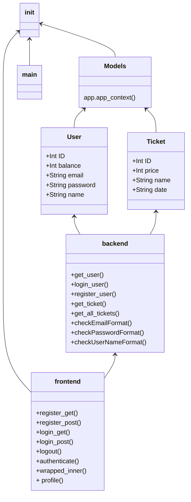

# Seet Geek Design Document
*Class and method descriptions.*

## \_\_init\_\_

This class initializes the application and sets it up to run with Flask.

## \_\_main\_\_
The main class runs the server at a given port.

## Models
Creates all the SQL tables and also contains the **Ticket** and **User** classes.
### app.app_context()
Function is used to create all the SQL tables if they do not exist.

## User
User class holds the information for a user (ID, email, password, name, balance) and is used to access database.

## Ticket
Ticket class hold the information for a ticket (ID, name, price, date) and is used to access database.

## backend
Holds all of the backend logic that interacts with the database and other services.
### get_user()
Function is used to get user by a given email.
### login_user()
This function authenticates the user by comparing the username and password to the database.
### register_user()
Used to register a new user into the database.
### get_ticket
Used to get a ticket from the database by its ID.
### get_all_tickets()
Used to get a list of all available tickets.
### checkEmailFormat()
Takes an email and compares it to a regex to see if it matches the standards.
### checkPasswordFormat()
Takes the users password and sees if it qualifies to be strong enough.
### checkUserNameFormat()
Makes sure that the username is alphanumeric, not too short or too long, and does not start or end with a space.

## frontend
Defines the front-end part of the app, handles http requests.

### register_get()
Gets the viewing of the register page.
### register_post()
Takes the data entered by the user and validates it, then if possible registers user in database.
### login_get()
Gets the viewing of the login page.
### login_post()
Takes the data entered by the user and validates it, then if possible, sends user to home page.
### logout()
Logs the user out of the system.
### authenticate()
Authenticates that the user is able to enter a new homepage session.
### profile()
Gets all tickets from ticket list to be displayed on users homepage.

